# 计算机网络和因特网 Computer Networks and the Internet

## 什么是Internet?

### 因特网的具体构成描述

因特网是一个世界范围的计算机网络，即它是一个互联了遍及全世界数十亿计算设备的网络。

**有趣的因特网互联设备**

数以亿计的互联计算设备：便携机、智能手机、平板电脑、电视、游戏机、温度调节装置、家用安全系统、家用电器、手表、眼镜、汽车、运输控制系统等。所有的这些设备都称为主机（***host***）或端系统（***end system***）。端系统通过通信链路（***communication link***）和分组交换机（***packet switch***）连接到一起。

**通信链路**（***communication link***）
光纤、同轴电缆、铜线和无线电频谱。
传输速率： 比特/秒 （bit/s, 或 bps）带宽

**分组交换设备：**
转发分组（***packets***）：路由器（***router***）和链路层交换机（***link-layer switch***）。链路层交换机通常用于接入网（***access networks***）中，而路由器通常用于网络核心（***network core***）中。

端系统通过因特网服务提供商（**Internet Service Provider**， ***ISP***）接入因特网。

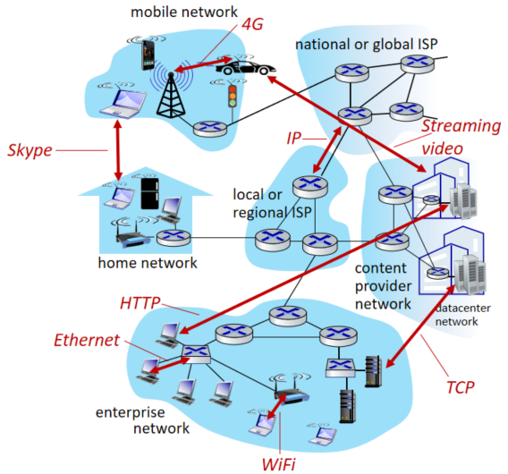

**因特网服务商：**
包括如本地电缆或电话公司那样的住宅区ISP、公司ISP、大学ISP，在机场、旅馆、咖啡店和其他公共场所提供WiFi接入的ISP，以及为智能手机和其他设备提供移动接入的蜂窝数据ISP。

端系统、分组交换机和其他因特网部件都要运行一系列协议（***protocol***）。协议控制发送、接收消息。如**TCP（Transmission Control Protocol，传输控制协议）**、**IP（Internet Protocol，网际协议）**、**HTTP**、**FTP**、**PPP**。TCP和IP是因特网中两个最为主要的协议。IP协议定义了在路由器和端系统之间发送和接收的分组格式。因特网的主要协议统称为**TCP/IP**

**Internet：“网络的网络”**

>1. 松散的层次结构，互连的ISP；
>2. 公共Internet、 专用Internet。

**Internet的标准：**

>1. 由因特网工程任务组（Internet Engineering Task Force,  **IETF**）研发。
>2. IETF的标准文档称为'**请求评论**'（Request For Comment, RPC）。

### 服务描述

从为应用程序提供服务的基础设施的角度来描述因特网。**分布式应用程序**（***distributed application***）：应用程序涉及多个相互交换数据的端系统。

应用程序：即时讯息、与实时道路流量信息的映射、来自云的音乐流、电影和电视流、在线社交网络、视频会议、多人游戏以及基于位置的推荐系统。

与因特网相连的端系统提供了一个**套接字接口**（***socket interface***），该接口规定了运行在一个端系统上的程序请求因特网基础设施向运行在另一个端系统上的特定目的地程序交付数据的方式。

因特网的两种描述方法：一种是根据它的硬件和软件组件来描述，两一种是根据基础设施向分布式应用程序提供服务来描述。

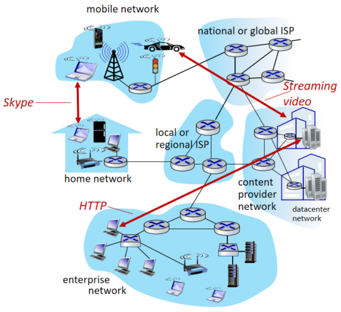

### 什么是协议

**人类活动的类比**

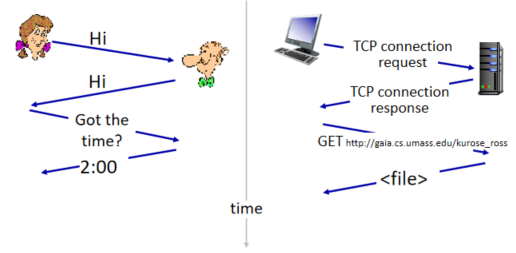

人类协议（至少说是好的行为方式）要求一方首先进行问候，以开始与另一个人的通信。人类协议中，有我们发送的特定报文，也有我们根据接收到的应答报文或其他事件（例如在某个给定的时间内没有回答）采取的动作。

**网络协议**

网络协议类似于人类协议，除了交换报文和采取动作的实体是某些设备（可以是计算机、智能手机、平板电脑、路由器或其他具有网络能力的设备）的硬件或软件组成。报文的交换以及发送和接收这些报文时所采取的动作是定义一个协议的关键元素：协议（protocol）定义了在两个或多个通信实体之间交换的报文的格式和顺序，以及报文发送和/或接收一条报文或其他事物所采取的动作。

# 网络边缘（Network edge）

通常把与因特网相连的计算机和其他设备称为**端系统**，因为它们位于因特网的边缘，故而被称为端系统。
因特网的端系统包括：桌面计算机（例如，桌面PC、Mac和Linux设备）、服务器（例如，Web和电子邮件服务器）和移动计算机（例如，便携机、智能手机和平板电脑）。

端系统也称为主机（***host***）= 端系统，因为它们容纳（即运行）应用程序，如Web浏览器程序、Web服务器程序、电子邮件客户程序或电子邮件服务器程序等。主机有时又被进一步划分为两类：**客户**（***client***）和**服务器**（***server***）。

## 接入网（Access networks）

接入网：将端系统物理连接到其**边缘路由器**（***edge router***）的网络。边缘路由器：是端系统到任何其他远程端系统的路径上的第一台路由器

**1. 家庭接入： DSL、电缆、FTTH、拨号和卫星**

宽带住宅接入最流行的两种类型： 数字用户线（Digital Subscriber Line, DSL）和电缆。住户通常从提供本地电话接入的本地电话公司处获得**DSL因特网接入**。

**电缆因特网接入** 利用了有线电视公司现有的有线电视基础设施。住宅从提供有线电视的公司获得了电缆因特网接入。

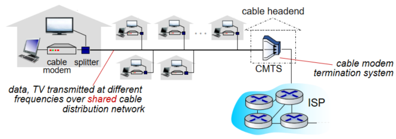

一种提供更高速率的新兴技术是光纤到户（Fiber To The Home, FTTH）。FTTH概念简单，从本地中心局直接到家庭提供了一条光纤路径。

光纤分布体系结构：主动光纤网络（Active Optical Network, AON）和被动光纤网络（Passive Optical Network, PON）。

**2. 企业（和家庭）接入：以太网和WiFi**

在公司和大学校园以及越来越多的家庭环境中，使用局域网（LAN）将端系统连接到边缘路由器。

在无线LAN环境中，无线用户从/到一个接入点发送/接收分支，该接入点与企业网连接（很可能使用了有线以太网），企业网再与有线因特网相连。一个无线LAN用户通常必须位于接入点的几十米范围内。

**3. 广域无线接入： 3G 和 LTE**

iPhone 和安卓等设备越来越多地用来在移动中发信息、在社交网络中分享照片、观看视频和放音乐。这些设备应用了与蜂窝移动电话相同的无线基础设施，通过蜂窝网提供商运营的基站来发送和接收分组。与WiFi不同的是，一个用户仅需要位于基站的数万米（而不是几十米）范围内。

## 物理媒介（***Physical media***）

对于每个发射器 — 接收器对，通过跨越一种物理媒体（***physical medium***）传播电磁波或光脉冲来发送该比特。物理媒体的例子包括双绞铜线、同轴电缆、多模光纤缆、陆地无线电频谱和卫星无线电频谱。物理媒体分成两种类型：导引型媒体（***guided media***）和非导引型媒体（***unguided media***）。

### 1. **双绞铜线**（Twisted-Pair Copper Wire）

最便宜且最常用的导引型传输媒体。由两根绝缘的铜线组成，没跟大于1mm粗，以规则的螺旋状排列着。

>类5线：100Mbps,1Gbps以太网
>
>类6线：10Gbps以太网

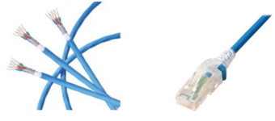

### **2. 同轴电缆**（Coaxial Cable）

与双绞线类似，同轴电缆由两个铜导体组成，但是这两个导体是同心的而不是并行的。同轴电缆能被用作导引型共享媒体。

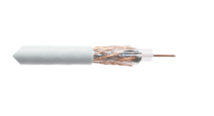

### **3. 光纤**（Fiber Optic Cable）

光纤是一种细而柔软的、能够导引光脉冲的媒体，每个脉冲表示一个比特。一个光纤能够支持极高的比特速率，高达数十甚至数百Gbps。

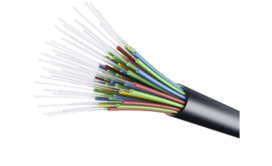

### 4. 陆地无线电信道（Terrestrial Radio Channels）

无线电信道承载电磁频谱中的信号。他不需要安装物理线路，并具有传统墙壁、提供与移动用户的连接以及长距离承载信号的能力，因而称为一种有吸引力的媒体。

### 5. 卫星无线电信道（Satellite Radio Channels）

一颗通信卫星连接地球上的两个或多个微波发射器/接收器，它们被称为地面站。该卫星在一个频段上接收传输，使用一个转发器再生信号，并在另一个频率上发射信号。通常使用的两类卫星：同步卫星和近地轨道卫星。

## 网络核心（Network Core）

网络核心，即由互联因特网端系统的分支交换机和链路构成的网状网络。

### 分组交换（Packet-switching）

为了从源端系统向目的端系统发送一个报文，源将长报文划分为较小的数据块，称之为分支（packet）。
在源目的地之间，每个分组都通过通信链路和分组交换机（***packet switch***）传送。交换机主要有两类：**路由器**和**链路层交换机**。

#### **1. 存储转发传输**

多数分组交换机在链路的输入端使用**存储转发传输**（***store-and-forward transmission***）机制。
存储转发传输是指在交换机能够开始向输出链路传输该分组的第一个比特之前，必须接收到整个分组。

发送延时（***Transmission delay***）:  需要花费${L}\over{R}$秒的时间发送（***push out***）L bits报文在 R bps链路中。

存储并转发（***Store and forward***）: 整个报文必须达到路由后才能发送给下一级链路。

端到端延时（***End-end delay***）: $$2{{L}\over{R}}$$上图两个链路，假设传播延时（***propagation delay***）为零。

​                                                                           $d_{e2e}$=$$N{{L}\over{R}}$$

#### **2. 排队时延和分组丢失**

每台分组交换机有多条链路与之相连。对于每条相连的链路，该分组交换机具有一个**输出缓存**（***output buffer***, 也称为**输出队列**（***output queue***）），它用于存储路由器准备发往那条链路的分组。如果到达的分组需要传输到某条链路，但发现该建立正忙于传输其他分支，该到达分组必须在输出缓存中等待。因此，除了存储转发时延以外，分支还要承受输出缓存的**排队时延**（***queuing delay***）。因为缓存空间的大小是有限的，一个到达的分组可能发现该缓存已被其等待传输的分组完全充满了。在此情况下，将出现**分组丢失（丢包）**（***packet loss***），到达的分组或已经排队的分组之一将被丢弃。

#### 3. 转发表和路由选择协议

当一个分组到达网络中的路由器时，路由器检查该分组的目的地址的一部分，并向一台相邻路由器转发该分组。更特别的是，每台路由器具有一个**转发表**（***forwarding table***），用于将目的地址（或目的地址的一部分）映射成为输出链表。因特网具有一些特殊的**路由选择协议**（***routing protocol***），用于自动地设置这些转发表。

### 电路交换（circuit-switching）

通过网络链路和交换机移动数据有两种基本方法：**电路交换**（***circuit switching***）和**分组交换**（***packet switching***）。

在电路交换网络中，在端系统间通信会话期间，预留了端系统间沿路径通信所需要的资源（缓存，链路传输速率）。

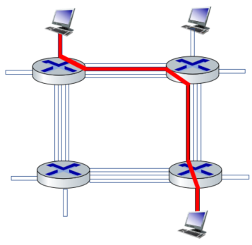

每台主机（例如PC和工作站）都与一台交换机直接相连。当两台主机要通信时，该网络在两台主机之间创建一条专用的**端到端链接**（***end- to- end connection***）。

#### 1. 电路交换网络中的复用

链路中的电路是通**过频分复用**（***Frequency- Division Multiplexing***, **FDM** ）或**时分复用**（***Time- Division Multiplexing***, **TDM**）来实现的。

对于FDM，链路的频谱由跨越链路创建的所有连接共享。频段的宽度称为**带宽**（***band-width***）。

对于一条TDM链路，时间被划分为固定期间的帧，并且每个帧又被划分为固定数量的时隙。当网络跨越一条链路创建一条连接时，网络在每个帧中为该连接指定一个时隙。

#### 2. 分组交换与电路交换的对比

电路交换不考虑需求，而预先分配了传输链路的使用，这使得已分配而并不需要的链路时间未被利用。
另一方面，分组交换按需分配链路使用。链路传输能力将在所有需要在链路是哪个传输分组的用户之间逐分组地被共享。

### 网络的网络（network of networks）

网络结构1，用单一的全球传输ISP互联所有接入ISP。

网络结构2，它由数十万接入ISP和多个全球传输ISP组成。

网络结构2是一种两层的等级结构，其中全球传输提供商位于顶层，而接入ISP位于底层。在任何给定的区域，可能有一个**区域ISP**（***regional ISP***），区域中的接入ISP与之连接。每个区域ISP则与第一层ISP（tier-1 ISP）连接。

网络结构3，不仅有多个竞争的第一层ISP，而且在一个区域可能有多个竞争的区域 ISP 。

任何ISP（除了第一层ISP）可以选择多宿（***multi-home***），即可以与两个或更多提供商ISP连接。对等：位于相同等级结构层次的邻近一对ISP能够**对等**（***peer***），也就是说，能够直接将它们的网络连到一起，使它们直接的所有流量经直接连接而不是通过上游的中间ISP传输。当两个ISP对等时，通常不进行结算，即任一个ISP不向其对等付费。

网络结构4，由接入ISP、区域ISP（regional ISP）、第一层ISP、PoP、多宿、对等和**因特网交换点**（***Internet Exchange Point***，**IXP**）组成。

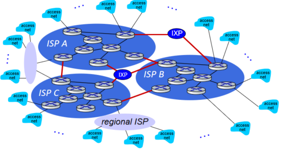

网络结构5，通过在网络结构4顶部增加**内容提供商网络**（***content provider network***）构建而成。

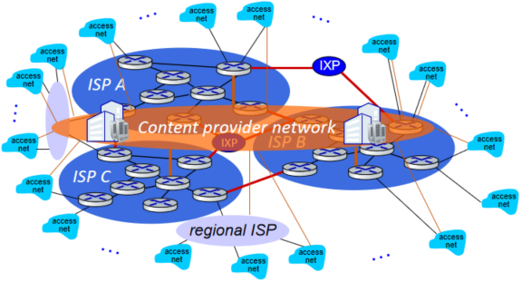

因特网是一个网络的网络，其接复杂，由十多个第一层ISP和数十万个较低层ISP组成。

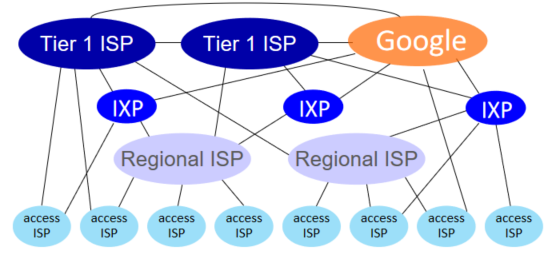

## 分组交换网中的时延(delay)、丢包(loss)和吞吐量(throughput)

### 分组交换网中的时延概述

当分组从一个节点（主机或路由器）沿着这条路径到后继节点（主机或路由器），该分组在沿途的每个节点经受了几种不同类型的时延。这些时延最重要的是**节点处理时延**（***nadal processing delay***）、**排队延时**（***queuing delay***）、**传输时延**（***transmission delay***）和**传播时延**（***propagation delay***），这些时延总体累加起来是节点总时延（***total nadal delay***）。

#### **时延的类型**

（1）处理时延
检查分组首部和决定将该分组导向何处所需要的时间是处理时延的一部分。
（2）排队时延
在队列中，当分组在链路上等待传输是，它经受排队时延。
（3）传输时延
用 L 比特表示该分组的长度，用 R bps（即 b/s）表示从路由器A到路由器B的链路传输速率。
传输时延是 L/R。这是将所有分组的比特推向链路（即传输，或者说发射）所需要的时间。
实际的传输时延通常在毫秒到微秒量级。

（4）传播时延
一旦一个比特被推向链路，该比特需要向路由器B传播。从该链路的起点到路由器B传播所需要的时间是传播时延。

（5）传输时延和传播时延的比较
传输时延是路由器推出分组所需要的时间，它是分组长度和链路传输速率的函数，而与两台路由器之间的距离无关。良医方面，传播时延是一个比特从一台路由器传播到另一台路由器所需要得时间，它是两台路由器之间距离的函数，而与分组长度或链路传输速率无关。

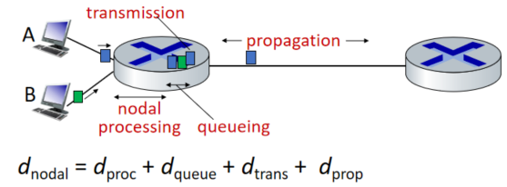

分组延时公式： ${d_{nodal}}$ = $d_{proc}$ + $d_{queue}$ + $d_{trans}$ + $d_{prop}$

#### 排队时延和丢包

当表征排队时延时，人们通常使用统计量来度量，如平均排队时延、排队时延的方差和排队时延超过某些特定值得概率。

排队时延的大小，很大程度取决于流量到达该队列的速率、链路的传输速率和到达流量的性质，即流量是周期性到达还是以突发形式到达。

比率 La/R 被称为**流量强度**（***traffic intensity***），它在估计排队时延的范围方面经常起着重要的作用。设计系统是流量强度不能大于1。

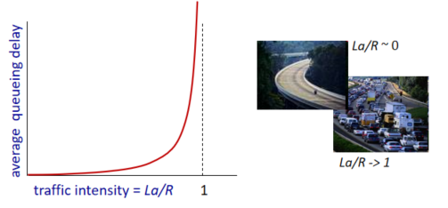

**丢包**

排队的容量是有限的，到达的分组发现一个满的队列，由于没有地方存储这个分组，路由器将丢弃该分组，即该分组将会丢弃（lost）。

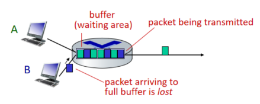

### 端到端时延

$d_{end-end}$ = N($d_{proc}$ + $d_{trans}$ + $d_{prop}$)

#### 1. Traceroute

Traceroute是一个简单的程序，它能够在任何因特网主机上运行。
当用户指定一个目的主机名字时，源主机中的该程序朝着目的地发送多个特殊的分组。当这些分组向着目的地传送时，它们通过一系列路由器。当路由器接收到这些特殊分组之一时，它向源回送一个短报文。该报文包括路由器的名字和地址。

#### 2. 端系统、应用程序和其他时延

### 计算机网络中的吞吐量（Throughput）

吞吐量：从发送方发送给接收方的bits速率。

**瞬时吞吐量**（***instantaneous throughput***）和**平均吞吐量**（***average throughput***）。

**瓶颈链路**（***bottleneck link***）

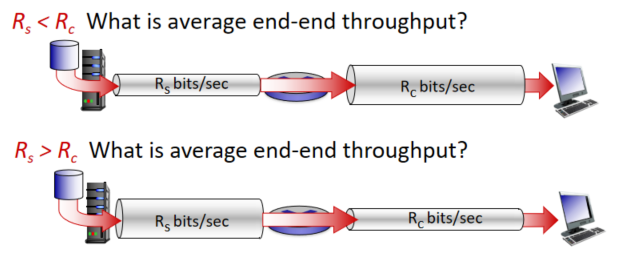

考虑到目标路径可接收得吞吐量，它会受到小容量管道的限制。组网传输容量最小的管道，将成为此链接的瓶颈。此链接有时也称为瓶颈链路。

**共享链接吞吐量**

## 协议层次及其服务模型

### 分层的体系结构

我们拿航空旅行系统作为一个例子。

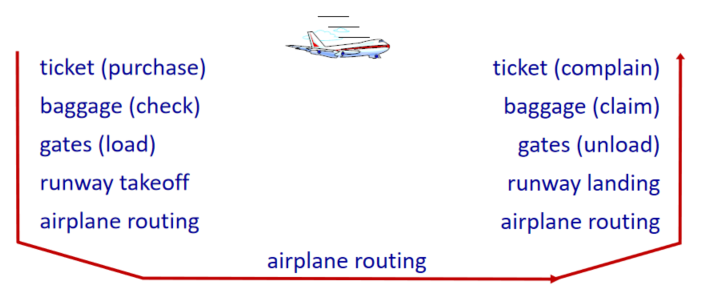

从买机票 -> 办理行李托运 -> 登机 -> 起飞 -> 航线飞行 -> 落地 -> 取行李 -> 票务评价。在每个层面我们享有不同的服务。

#### 1. 协议分层

以分层（layer）的方式组织协议以及实现这些协议的网络硬件和软件。某曾向他的上一层提供的服务（***service***），即所谓一层的**服务模型**（***service model***）。各层的所有协议被称为**协议栈**（***protocol stack***）。
因特网的协议栈由5个层次组成：
物理层、链路层、网络层、运输层和应用层。

（1）应用层
应用层是网络应用程序及它们的应用层协议留的地方。
应用层协议：HTTP、SMTP和FTP。
HTTP：提供了Web文档的请求和传送；
SMTP：提供了电子邮件报文的传输；
FTP：提供了两个端系统之家的文件传送。

位于应用层的信息分析称为**报文**（***message***）。

（2）运输层
因特网的运输层在应用程序端点之间传送应用层报文。
运输协议：TCP、UDP。
TCP：向它的应用程序提供了面向连接的服务。
UDP：向它的应用程序提供无连接服务。

运输层的分组称为**报文段**（***segment***）。

（3）网络层
因特网的网络层负责将称为**数据报**（***datagram***）的网络层分组从一台主机移动到另一台主机。
网络层协议：IP。IP：该协议定义了在数据报文中的各个字段以及端系统和路由器如何作用于这些字段。

（4）链路层
因特网的网络层通过源和目的地之间的一系列路由器路由数据报。为了将分组从一个结点（主机或路由器）移动到路径上的下一个结点，网络层必须依靠该链路层的服务。由链路层提供的服务取决于应用于该链路的特定链路层协议。链路层的例子包括以太网、WiFi和电缆接入网的DOCSIS协议。链路层的分组称为**帧**（***frame***）。

（5）物理层
物理层的任务是将该帧中的一个个比特从一个节点移动到下一个节点。协议仍然是链路层相关的，并且进一步与该链路（例如，双绞铜线、单模光纤）的实际传输媒体相关。

### 封装（Encapsulation）

在发送主机端，一个**应用层报文**（***application-layer message***）被传输个运输层。应用层报文和运输层首部信息一道构成了**运输层报文段**（***transport-layer segment***）。运输层则向网络层传递该报文段，网络层增加了如源和目的端系统地址等网络层首部信息，生成了**网络层数据报**（***network-layer datagram***）。链路层（自然而然地）增加了它自己的链路层首部信息并生成**链路层帧**（***link-layer frame***）。在每一层，一个分组具有两种类型的字段：首部字段和**有效载荷字段**（***payload field***）。

学习参考资料：

[计算机网络——自顶向下方法-PPT教程-Chapter_1](../lectures/slides/8th.Edition/Chapter_1_v8.0.pptx)

[计算机网络——自顶向下方法原版 第八版](../pdf/Computer.Networking.A.Top-Down.Approach.8th.(z-lib.org).pdf)

[B站 中科大计算机网络教程](https://www.bilibili.com/video/BV1JV411t7ow)

[B站 原书作者Kurose, James教程](https://www.bilibili.com/video/BV1mb4y1d7K7)
