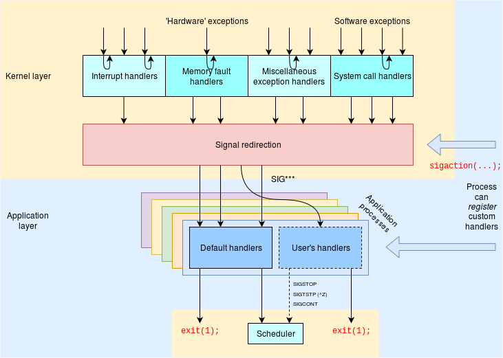
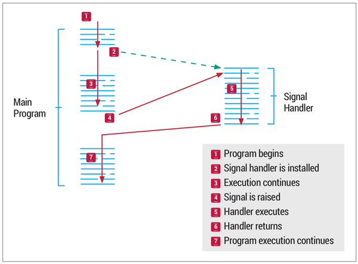
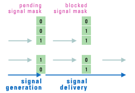

# QNX®  Neutrino 进程间通信编程之Signals

## 介绍

Interprocess Communication（IPC，进程间通信）在QNX Neutrino从一个嵌入式实时系统向一个全面的POSIX系统转变起着至关重要的作用。IPC是将在内核中提供各种服务的进程内聚在一起的粘合剂。在QNX中，消息传递是IPC的主要形式，也提供了其他的形式，除非有特殊的说明，否则这些形式也都是基于本地消息传递而实现的。

将更高级别的 IPC 服务（如通过我们的消息传递实现的管道和 FIFO）与其宏内核对应物进行比较的基准测试表明性能相当。

QNX Neutrino提供以下形式的IPC：

| Service:             | Implemented in:  |
| -------------------- | ---------------- |
| Message-passing      | Kernel           |
| Pules                | Kernel           |
| **Signals**          | **Kernel**       |
| Event Delivery       | External process |
| POSIX message queues | External process |
| Shared memory        | Process manager  |
| Pipes                | External process |
| FIFOs                | External process |

本篇幅介绍的是POSIX IPC Signals。


## Signals

进程属于用户应用程序或操作系统。 我们需要一种机制让内核和这些进程协调它们的活动。 一种方法是让流程在发生重要事件时通知其他人。 这就是为什么我们有信号。信号基本上是一种单向通知。 信号可以由内核发送给一个进程，一个进程发送给另一个进程，或者一个进程发送给它自己。

下图试图捕捉硬件级异常（包括系统调用）和信号与应用程序进程的关系。



许多硬件中断由它们自己的设备驱动程序处理； 偶尔中断会启动一个信号。 内存故障通常由分页处理或用于更新内部内核状态——但有时会是真正的分段违规。 虽然大多数系统调用是为同一个进程提供服务，但有几个能够发送信号作为进程间通信，尤其是在父子进程之间。


**信号是同步的还是异步的？**

当信号产生时，它们可以被认为是同步的**synchronous** 或异步的**asynchronous**。

**synchronous**信号是由于指令导致不可恢复的错误（例如非法地址访问）而产生的。 这些信号被发送到引起它的线程。 这些也称为陷阱，因为它们也会导致进入内核陷阱处理程序的陷阱

**asynchronous**信号在当前执行上下文的外部。 从另一个进程发送 SIGKILL 就是一个例子。 这些也称为软件中断。


**信号的典型生命周期是什么？**



一个信号经历三个阶段：

**Generation**：信号可以由内核或任何进程生成。无论谁生成信号，都会将其发送到特定进程。信号由其编号表示，没有额外的数据或参数。因此，信号是轻量级的。但是，可以为 POSIX 实时信号传递额外的数据。可以生成信号的系统调用和函数包括 raise、kill、killpg、pthread_kill、tgkill 和 sigqueue。
**Delivery**：一个信号被认为是挂起的，直到它被交付。通常，内核会尽快将信号传递给进程。但是，如果进程阻塞了信号，它将保持挂起状态直到解除阻塞。
**Processing**：一旦信号被传递，它就会以多种方式之一进行处理。每个信号都有一个关联的默认操作：忽略信号；或终止进程，有时使用核心转储；或停止/继续该过程。对于非默认行为，可以调用处理程序函数。通过 sigaction 函数指定这些发生的确切情况。


## 标准或常规信号


通过`kill -l`我们可以查询到系统下包含的64个信号是什么？

```shell
bspserver@ubuntu:~/workspace/$ kill -l
 1) SIGHUP	 2) SIGINT	 3) SIGQUIT	 4) SIGILL	 5) SIGTRAP
 6) SIGABRT	 7) SIGBUS	 8) SIGFPE	 9) SIGKILL	10) SIGUSR1
11) SIGSEGV	12) SIGUSR2	13) SIGPIPE	14) SIGALRM	15) SIGTERM
16) SIGSTKFLT	17) SIGCHLD	18) SIGCONT	19) SIGSTOP	20) SIGTSTP
21) SIGTTIN	22) SIGTTOU	23) SIGURG	24) SIGXCPU	25) SIGXFSZ
26) SIGVTALRM	27) SIGPROF	28) SIGWINCH	29) SIGIO	30) SIGPWR
31) SIGSYS	34) SIGRTMIN	35) SIGRTMIN+1	36) SIGRTMIN+2	37) SIGRTMIN+3
38) SIGRTMIN+4	39) SIGRTMIN+5	40) SIGRTMIN+6	41) SIGRTMIN+7	42) SIGRTMIN+8
43) SIGRTMIN+9	44) SIGRTMIN+10	45) SIGRTMIN+11	46) SIGRTMIN+12	47) SIGRTMIN+13
48) SIGRTMIN+14	49) SIGRTMIN+15	50) SIGRTMAX-14	51) SIGRTMAX-13	52) SIGRTMAX-12
53) SIGRTMAX-11	54) SIGRTMAX-10	55) SIGRTMAX-9	56) SIGRTMAX-8	57) SIGRTMAX-7
58) SIGRTMAX-6	59) SIGRTMAX-5	60) SIGRTMAX-4	61) SIGRTMAX-3	62) SIGRTMAX-2
63) SIGRTMAX-1	64) SIGRTMAX	
```

| Signal range | Description                                                  |
| ------------ | ------------------------------------------------------------ |
| 1–56         | 56 POSIX signals (including traditional UNIX signals) 56个POSIX信号（其中包含传统的UNIX信号） |
| 41–56        | 16 POSIX realtime signals (SIGRTMIN to SIGRTMAX) 16个POSIX实时信号 |
| 57–64        | Eight special-purpose QNX Neutrino signals, some of which are named (e.g., SIGSELECT). They're always masked, and attempts to unmask them are ignored. |

下面只介绍我们常用的信号

| Signal      | Value | Action | Comment                                                      |
| :---------- | :---: | :----: | ------------------------------------------------------------ |
| **SIGHUP**  |   1   |  Term  | Hangup detected on controlling terminal or death of controlling process  如果终端界面检测到一个连接断开，则将此信号送给与该终端相关的控制进程。 |
| **SIGINT**  |   2   |  Term  | Interrupt from keyboard  当用户按中断键（一般采用DELETE或Ctrl-C）时，终端驱动程序产生此信号并送至前台进程组中的每一个进程。 |
| **SIGQUIT** |   3   |  Core  | Quit from keyboard  当用户在终端上按退出键（一般采用Ctrl-\）时，产生此信号，并送至前台进程组中的所有进程。 |
| **SIGILL**  |   4   |  Core  | Illegal Instruction  此信号指示进程已执行一条非法硬件指令。  |
| **SIGABRT** |   6   |  Core  | Abort signal from [abort(3)](https://www.man7.org/linux/man-pages/man3/abort.3.html) 调用abort函数时产生此信号，进程异常终止。 |
| **SIGFPE**  |   8   |  Core  | Floating point exception  此信号表示一个算术运算异常，例如除以0，浮点溢出等。 |
| **SIGKILL** |   9   |  Term  | Kill signa  这是两个不能被捕捉或忽略信号中的一个。           |
| **SIGUSR1** |  10   |  Term  | User-defined signal 1  这是一个用户定义的信号，可用于应用程序。 |
| **SIGSEGV** |  11   |  Core  | Invalid memory reference  指示进程进行了一次无效的存储访问。名字SEGV表示“段违例（segmentation violation）”。 |
| **SIGUSR2** |  12   |  Term  | User-defined signal 2  这是一个用户定义的信号，可用于应用程序。 |
| **SIGPIPE** |  13   |  Term  | Broken pipe: write to pipe with no readers  如果在读进程已终止时写管道，则产生此信号。 |
| **SIGALRM** |  14   |  Term  | Timer signal from [alarm(2)](https://www.man7.org/linux/man-pages/man2/alarm.2.html)  当用alarm函数设置得定时器超时时，产线此信号。若有setitimer函数设置得间隔时间已经超时时，也产生此信号。 |
| **SIGTERM** |  15   |  Term  | Termination signal  这是由kill ( 1 )命令发送的系统默认终止信号。 |
| **SIGCHLD** |  17   |  Ign   | Child stopped or terminated  在一个进程终止或停止时，SIGCHLD信号被送给其父进程。按系统默认，将忽略此信号。如果父进程希望了解其子进程的这种状态改变，则应捕捉此信号。信号捕捉函数中通常要调用wait函数以取得子进程I D和其终止状态。 |
| **SIGCONT** |  18   |  Cont  | Continue executing, if stopped.  此作业控制信号送给需要继续运行的处于停止状态的进程。如果接收到此信号的进程处于停止状态，则系统默认动作是使该进程继续运行，否则默认动作是忽略此信号。 |
| **SIGSTOP** |  19   |  Stop  | Stop process  这是一个作业控制信号，它停止一个进程。它类似于交互停止信号( SIGTSTP )，但是SIGSTOP不能被捕捉或忽略。 |
| **SIGTSTP** |  120  |  Stop  | Stop typed at terminal  交互停止信号，当用户在终端上按挂起键 （一般采用Ctrl-Z）时，终端驱动程序产生此信号。 |
| **SIGTTIN** |  21   |  Stop  | Terminal input for background process  当一个后台进程组进程试图读其控制终端时，终端驱动程序产生此信号。 |
| **SIGTTOU** |  22   |  Stop  | Terminal output for background process  当一个后台进程组进程试图写其控制终端时产生此信号。 |


## **POSIX signals API**

下表总结了常用的POSIX信号API接口：

| **Function**          | **Description**                          |
| --------------------- | ---------------------------------------- |
| **kill()**            | Send a signal to a process               |
| **sigemptyset()**     | Set a set of signals to NULL             |
| **sigfillset()**      | Set all signals in a set                 |
| **sigaddset()**       | Add an individual signal to a set        |
| **sigdelset()**       | Delete an individual signal from a set   |
| **sigismember()**     | Test whether a signal is member of a set |
| **sigaction()**       | Set/Examine action for a given signal.   |
| **pthread_sigmask()** | Set/Examine signal mask for a pthread    |
| **sigprocmask()**     | Set/Examine signal mask for a process    |
| **sigpending()**      | Examine pending signals                  |
| **sigsuspend()**      | Wait for a signal                        |
| **sigwait()**         | Accept a signal                          |
| **pthread_kill()**    | Send a signal to a given thread          |
| **alarm()**           | Schedule delivery of an alarm signal     |
| **pause()**           | Suspend process execution                |
| **sleep()**           | Delay process execution                  |


### signal函数

```C
#include <signal.h>
#define SIG_ERR (void (*)())-1
#define SIG_DFL (void (*)())0
#define SIG_IGN (void (*)())1

void ( * signal( int sig, void ( * func)(int) ) )( int );
                                  返回：成功则为以前的信号处理配置，若出错则为 SIG_ERR
```

>*sig*参数是`常见的标准进程信号`表中的信号名。*func*的值是：(a)常数SIG_IGN，或(b)常数SIG_DFL，或(c)当接到此信号后要调用的函数的地址。如果指定SIG_IGN，则向内核表示忽略此信号。（记住有两个信号SIGKILL和SIGSTOP不能忽略。）如果指定SIG_DFL，则表示接到此信号后的动作是系统默认动作。当指定函数地址时，我们称此为捕捉此信号。我们称此函数为信号处理程序（signal handler）或信号捕捉函数（signal-catching function）。

```C
#include <unistd.h>
#include <signal.h>
#include <stdio.h>
#include <sys/types.h>
#include <sys/wait.h>
static void sig_usr(int); /* one handler for both signals */
int 
main(void) 
{ 
	 if (signal(SIGUSR1, sig_usr) == SIG_ERR) 
		  perror("can't catch SIGUSR1"); 
	  if (signal(SIGUSR2, sig_usr) == SIG_ERR) 
		   perror("can't catch SIGUSR2"); 
	   for ( ; ; ) 
		    pause(); 
} 
static void 
sig_usr(int signo) /* argument is signal number */ 
{ 
	 if (signo == SIGUSR1) 
		  printf("received SIGUSR1\n"); 
	  else if (signo == SIGUSR2) 
		   printf("received SIGUSR2\n"); 
	   else 
		    printf("received signal %d\n", signo); 
}
```

我们使该程序在后台运行，并且用kill(1)命令将信号送给它。kill(1)命令和kill(2)函数只是将一个信号送给一个进程或进程组。该信号是否终止该进程则取决于该信号的类型，以及该进程是否安排了捕捉该信号。

```shell
$ a.out &         #在后台启动进程
[1]    4720       #作业控制shell打印作业号和进程ID
$ kill -USR1 4720 #向该进程发送SIGUSR1
received SIGUSR1
$ kill -USR2 4720 #向该进程发送SIGUSR2
received SIGUSR2
$ kill 4720       #向该进程发送SIGTERM
[1] + Terminated a.out &
```

当向该进程发送SIGTERM信号后，该进程就终止，因为它不捕捉此信号，而对此信号的系统默认动作是终止。


### sigaction函数

sigaction函数的功能是检查或修改 (或两者)与指定信号相关联的处理动作。

```C
#include <signal.h>

struct sigaction {
void (*sa_handler)(int); /* addr of signal handler, */
/* or SIG_IGN, or SIG_DFL */
sigset_t sa_mask; /* additional signals to block */
int sa_flags; /* signal options, Figure 10.16 */
    /* 影响信号行为的标志：
    SA_NOCLDSTOP 不要在父节点上为通过 SIGSTOP 停止的子节点生成 SIGCHLD。 该标志仅在信号为 SIGCHLD 时使用。
    SA_NOCLDWAIT 不要在子进程终止时创建僵尸进程或状态信息。
    SA_NODEFER   不要在进入处理程序时自动阻塞信号。
    SA_RESETHAND 将处理程序重置为 SIG_DFL 并在进入信号处理程序时清除 SA_SIGINFO。 在 QNX Neutrino 中，如果您设置 
                 SA_RESETHAND，sigaction() 和 SignalAction() 的行为就像您还设置了 SA_NODEFER。
                 如果将 SA_RESETHAND 设置为 SIGILL 或 SIGTRAP，则这些函数将忽略它。
    SA_SIGINFO   排队这个信号。 默认设置是不对传递给进程的信号进行排队。 如果信号未排队，并且在运行之前在进程或线程上
                 多次设置相同的信号，则只会传递最后一个信号。 如果您设置了 SA_SIGINFO 标志，信号将排队，并且全部被传送。
/* alternate handler */
void (*sa_sigaction)(int, siginfo_t *, void *);
};

int sigaction( int sig, const struct sigaction * act, struct sigaction * oact );
```

其中，参数*sig*是要检测或修改具体动作的信号的编号数。若 *act*指针非空，则要修改其动作。如果*oact*指针非空，则系统返回该信号的原先动作。

注册信号处理函数是通过系统调用signal()、sigaction()。其中signal()在可靠信号系统调用的基础上实现, 是库函数。它只有两个参数，不支持信号传递信息，主要是用于前32种非实时信号的安装；而sigaction()是较新的函数（由两个系统调用实 现：sys_signal以 sys_rt_sigaction），有三个参数，支持信号传递信息，主要用来与 sigqueue() 系统调用配合使用，当然，sigaction()同样支持非实时信号的安装。sigaction()优于signal()主要体现在支持信号带有参数。


### **可重入函数**

POSIX.1说明了保证可再入的函数。下表列出了这些可再入函数。

|               |             |                   |             |                  |
| ------------- | ----------- | ----------------- | ----------- | ---------------- |
| abort         | faccessat   | linkat            | select      | socketpair       |
| accept        | fchmod      | listen            | sem_post    | stat             |
| access        | fchmodat    | lseek             | send        | symlink          |
| aio_error     | fchown      | lstat             | sendmsg     | symlinkat        |
| aio_return    | fchownat    | mkdir             | sendto      | tcdrain          |
| aio_suspend   | fcntl       | mkdirat           | setgid      | tcflow           |
| alarm         | fdatasync   | mkfifo            | setpgid     | tcflush          |
| bind          | fexecve     | mkfifoat          | setsid      | tcgetattr        |
| cfgetispeed   | fork        | mknod             | setsockopt  | tcgetpgrp        |
| cfgetospeed   | fstat       | mknodat           | setuid      | tcsendbreak      |
| cfsetispeed   | fstatat     | open              | shutdown    | tcsetattr        |
| cfsetospeed   | fsync       | openat            | sigaction   | tcsetpgrp        |
| chdir         | ftruncate   | pause             | sigaddset   | time             |
| chmod         | futimens    | pipe              | sigdelset   | timer_getoverrun |
| chown         | getegid     | poll              | sigemptyset | timer_gettime    |
| clock_gettime | geteuid     | posix_trace_event | sigfillset  | timer_settime    |
| close         | getgid      | pselect           | sigismember | times            |
| connect       | getgroups   | raise             | signal      | umask            |
| creat         | getpeername | read              | sigpause    | uname            |
| dup           | getpgrp     | readlink          | sigpending  | unlink           |
| dup2          | getpid      | readlinkat        | sigprocmask | unlinkat         |
| execl         | getppid     | recv              | sigqueue    | utime            |
| execle        | getsockname | recvfrom          | sigset      | utimensat        |
| execv         | getsockopt  | recvmsg           | sigsuspend  | utimes           |
| execve        | getuid      | rename            | sleep       | wait             |
| _Exit         | kill        | renameat          | sockatmark  | waitpid          |
| _exit         | link        | rmdir             | socket      | write            |


### **kill和raise函数**

kill函数将信号发送给进程或进程组。raise函数则允许进程向自身发送信号。

```C
#include <signal.h>
int kill(pid_t pid, int sig);
int raise(int sig);
                             两个函数返回：若成功则为 0，若出错则为-1
```

>kill的*pid*参数有四种不同的情况：
>
>• *pid* > 0 将信号发送给进程ID为*pid*的进程。
>
>• *pid* == 0 将信号发送给其进程组ID等于发送进程的进程组ID，而且发送进程有许可权向其发送信号的所有进程。
>
>• *pid* < 0 将信号发送给其进程组ID等于*pid*绝对值，而且发送进程有许可权向其发送信号的所有进程。如上所述一样，“所有进程”并不包括系统进程集中的进程。
>
>• *pid* == -1 （QNX Neutrino 7.0 或更高版本）该进程有权发送该信号的所有进程。

**kill函数用法**

```C
#include <stdio.h>
#include <unistd.h>
#include <signal.h>
void sig_handler(int sig)
{
    printf("Inside handler function \n");
}

int main()
{
    pid_t pid;
    signal(SIGUSR1,sig_handler);  // Register signal handler
    printf("Inside main function \n");
    pid=getpid();                 // Process ID of itself
    kill(pid,SIGUSR1);
    printf("Inside main function \n");
    return 0; 
}
```

**raise函数用法**

```C
#include <stdio.h>
#include <signal.h>

void sig_handler(int sig)
{
    printf("Inside handler function \n");
}

int main()
{
    signal(SIGUSR1,sig_handler);  // Register signal handler
    printf("Inside main function \n");
    raise(SIGUSR1);
    printf("Inside main function \n");
    return 0;
}
```

运行结果如下：

```shell
Inside main function 
Inside handler function 
Inside main function 
```


### **alarm和pause函数**

使用alarm函数可以设置一个时间值(闹钟时间)，在将来的某个时刻该时间值会被超过。当所设置的时间值被超过后，产生 SIGALRM信号。如果不忽略或不捕捉此信号，则其默认动作是终止该进程。

```C
#include <unistd.h>

unsigned int alarm( unsigned int seconds );
                                           返回：0或以前设置的闹钟时间的余留秒数
```

>参数*seconds*的值是秒数，经过了指定的*seconds*秒后会产生信号SIGALRM。要了解的是，经过了指定秒后，信号由内核产生，由于进程调度的延迟，进程得到控制能够处理该信号还需一段时间。

每个进程只能有一个闹钟时间。如果在调用 alarm时，以前已为该进程设置过闹钟时间，而且它还没有超时，则该闹钟时间的余留值作为本次al arm函数调用的值返回。以前登记的闹钟时间则被新值代换。

如果有以前登记的尚未超过的闹钟时间，而且 *seconds*值是0，则取消以前的闹钟时间，其余留值仍作为函数的返回值。

虽然SIGALRM的默认动作是终止进程，但是大多数使用闹钟的进程捕捉此信号。如果此时进程要终止，则在终止之前它可以执行所需的清除操作。

pause函数使调用进程挂起直至捕捉到一个信号。

```C
#include <unistd.h>

int pause( void );
                   返回：-1，errno设置为EINTR
```

只有执行了一个信号处理程序并从其返回时，pause才返回。在这种情况下，pause返回-1，errno设置为EINTR。

利用alarm来实现个不完善的sleep

```C
#include	<setjmp.h>
#include	<signal.h>
#include	<unistd.h>

static jmp_buf	env_alrm;

static void
sig_alrm(int signo)
{
	longjmp(env_alrm, 1);
}

unsigned int
sleep2(unsigned int seconds)
{
	if (signal(SIGALRM, sig_alrm) == SIG_ERR)
		return(seconds);
	if (setjmp(env_alrm) == 0) {
		alarm(seconds);		/* start the timer */
		pause();			/* next caught signal wakes us up */
	}
	return(alarm(0));		/* turn off timer, return unslept time */
}
```

在一个捕捉其他信号的程序中调用 sleep2

```C
#include "apue.h"

unsigned int	sleep2(unsigned int);
static void		sig_int(int);

int
main(void)
{
	unsigned int	unslept;

	if (signal(SIGINT, sig_int) == SIG_ERR)
		err_sys("signal(SIGINT) error");
	unslept = sleep2(5);
	printf("sleep2 returned: %u\n", unslept);
	exit(0);
}

static void
sig_int(int signo)
{
	int				i, j;
	volatile int	k;

	/*
	 * Tune these loops to run for more than 5 seconds
	 * on whatever system this test program is run.
	 */
	printf("\nsig_int starting\n");
	for (i = 0; i < 300000; i++)
		for (j = 0; j < 4000; j++)
			k += i * j;
	printf("sig_int finished\n");
}
```

运行结果

```shell
$ ./tsleep2 
^C
sig_int starting
sig_int finished
sleep2 returned: 2   ##表示alarm被Ctrl-C 信号唤醒后alarm还剩2s，剩余时间得多杀取决于sig_int处理了多长时间。
```


### **信号集**

```C
typedef struct {

　　unsigned long sig [_NSIG_WORDS];

　　} sigset_t
    
#include <signal.h>

int sigemptyset( sigset_t *set );    //初始化由set指定的信号集，信号集里面的所有信号被清空，相当于64为置0
int sigfillset( sigset_t *set );     //调用该函数后，set指向的信号集中将包含POSIX支持的64种信号，相当于64为都置1；
int sigaddset( sigset_t *set, int signo );    //在set指向的信号集中加入signum信号，相当于将给定信号所对应的位置1；
int sigdelset( sigset_t *set, int signo );    //在set指向的信号集中删除signum信号，相当于将给定信号所对应的位置0；
                                           四个函数返回：若成功则为0，若出错则为-1
int sigismember( const sigset_t *set, int signo );
//判定信号signum是否在set指向的信号集中，相当于检查给定信号所对应的位是0还是1。
                                                   返回：若真则为1，若假则为0
```

函数**sigemptyset**初始化由*set*指向的信号集，使排除其中所有信号。函数 **sigfillset**初始化由*set*指向的信号集，使其包括所有信号。所有应用程序在使用信号集前，要对该信号集调用**sigemptyse** t或**sigfillset**一次。这是因为C编译程序将不赋初值的外部和静态度量都初始化为 0，而这是否与给定系统上信号集的实现相对应并不清楚。一旦已经初始化了一个信号集，以后就可在该信号集中增、删特定的信号。函数 **sigaddset**将一个信号添加到现存集中， **sigdelset**则从信号集中删除一个信号。对所有以信号集作为参数的函数，都向其传送信号集地址。

```C
#include <stdio.h>
#include <unistd.h>
#include <stdlib.h>
#include <signal.h>
#include <sys/types.h>
void print_sigset(sigset_t *set);
int main(void)
{
    sigset_t myset;
    sigemptyset(&myset);
    sigaddset(&myset,SIGINT);
    sigaddset(&myset,SIGQUIT);
    sigaddset(&myset,SIGUSR1);
    sigaddset(&myset,SIGRTMIN);
    print_sigset(&myset);

    return 0;

}
void print_sigset(sigset_t *set)
{
    int i;
    printf("Binary:");
    for(i = 1; i < NSIG; ++i){
        if(sigismember(set,i))
            printf("1");
        else
            printf("0");
    }
    putchar('\n');
    printf("Hex:");
	i = SIGRTMAX;
	do {
		int x = 0;
		i -= 4;
		if (sigismember(set, i+1)) x |= 1;
		if (sigismember(set, i+2)) x |= 2;
		if (sigismember(set, i+3)) x |= 4;
		if (sigismember(set, i+4)) x |= 8;
		printf("%x", x);
	} while (i >= 4); 
    putchar('\n');
}
```

运行结果如下：

```shell
bspserver@bspserver-SH:~/WorkSpace/apue.3e/signals$ gcc sigset.c -o sigset
bspserver@bspserver-SH:~/WorkSpace/apue.3e/signals$ ./sigset 
Binary:0110000001000000000000000000000001000000000000000000000000000000
Hex:0000000200000206
```


### sigprocmask函数

调用函数sigprocmask可以检测或更改(或两者)进程的信号屏蔽字。

```C
#include <signal.h>

int sigprocmask( int how, const sigset_t *set, sigset_t *oset );
                                                                 返回：若成功则为0，若出错则为-1
```

首先，*oset*是非空指针，进程的当前信号屏蔽字通过 *oset*返回。其次，若 *set*是一个非空指针，则参数*how*指示如何修改当前信号屏蔽字。表说明了*how*可选用的值。SIG_BLOCK是或操作，而SIG_SETMASK则是赋值操作。

| how         | 说明                                                         |
| ----------- | ------------------------------------------------------------ |
| SIG_BLOC    | 该进程新的信号屏蔽字是其当前信号屏蔽字和 set指向信号集的并集。 set包含了我们希望阻塞的附加信号。 |
| SIG_UNBLOC  | 该进程新的信号屏蔽字是其当前信号屏蔽字和set所指向信号集的交集。 set包含了我们希望解除阻塞的信号。 |
| SIG_SETMASK | 该进程新的信号屏蔽是*set*指向的值。                          |

如果*set*是个空指针，则不改变该进程的信号屏蔽字， *how*的值也无意义。如果在调用sigprocmask后有任何未决的、不再阻塞的信号，则在 sigprocmask返回前，至少将其中之一递送给该进程。

**你能解释一下阻塞和解除阻塞信号的概念吗？**

>
>
>
>
>
>
>每个进程都可以指定是否要阻止特定信号。如果被阻塞并且信号确实发生，操作系统会将信号保持为挂起状态。一旦进程解除阻塞，信号就会被传递。当前阻塞的信号集称为信号掩码。无限期地阻塞信号是没有意义的。为此，进程可以在信号传递后忽略该信号。
>
>一个进程阻塞的信号不会影响其他进程，其他进程可以正常接收信号。
>
>可以使用 sigprocmask（单线程）或 pthread_sigmask（多线程）设置信号掩码。当一个进程有多个线程时，可以在每个线程的基础上阻塞一个信号。信号将被传递到任何一个没有阻塞它的线程。本质上，信号处理程序是每个进程，信号掩码是每个线程。


### sigpending函数

sigpending返回对于调用进程被阻塞不能递送和当前未决的信号集。该信号集通过 *set*参数返回。

```C
#include <signal.h>

int sigpending( sigset_t *set );
                                 返回：若成功则为0，若出错则为-1
```

sigpending实例

```C
#include "apue.h"

static void	sig_quit(int);

int
main(void)
{
	sigset_t	newmask, oldmask, pendmask;

	if (signal(SIGQUIT, sig_quit) == SIG_ERR)
		err_sys("can't catch SIGQUIT");

	/*
	 * Block SIGQUIT and save current signal mask.
	 */
	sigemptyset(&newmask);
	sigaddset(&newmask, SIGQUIT);
	if (sigprocmask(SIG_BLOCK, &newmask, &oldmask) < 0)
		err_sys("SIG_BLOCK error");

	sleep(5);	/* SIGQUIT here will remain pending */

	if (sigpending(&pendmask) < 0)
		err_sys("sigpending error");
	if (sigismember(&pendmask, SIGQUIT))
		printf("\nSIGQUIT pending\n");

	/*
	 * Restore signal mask which unblocks SIGQUIT.
	 */
	if (sigprocmask(SIG_SETMASK, &oldmask, NULL) < 0)
		err_sys("SIG_SETMASK error");
	printf("SIGQUIT unblocked\n");

	sleep(5);	/* SIGQUIT here will terminate with core file */
	exit(0);
}

static void
sig_quit(int signo)
{
	printf("caught SIGQUIT\n");
	if (signal(SIGQUIT, SIG_DFL) == SIG_ERR)
		err_sys("can't reset SIGQUIT");
}
```

然后该进程再睡眠5秒钟。如果在此期间再产生退出信号，那么它就会使该进程终止，因为在上次捕捉到该信号时，已将其处理方式设置为默认动作。此时如果键入终端退出字符 `Ctrl-\`，则输出“QUIT ( coredump )”信息，表示进程因接到 SIGQUIT而终止，但是在core文件中保存了与进程有关的信息(该信息是由shell发现其子进程异常终止时打印的)。

```shell
bspserver@bspserver-SH:~/WorkSpace/apue.3e/signals$ ./critical 
^\                                               #产生信号一次(在5秒之内)
SIGQUIT pending                                  #从sleep返回后
caught SIGQUIT                                   #在信号处理程序中
SIGQUIT unblocked                                #从sigprocmask返回后
^\Quit (core dumped)                             #再次产生信号
bspserver@bspserver-SH:~/WorkSpace/apue.3e/signals$ ./critical 
^\^\^\^\^\^\^\^\^\^\                             #产生信号10次(在5秒之内)
SIGQUIT pending
caught SIGQUIT                                   #只产生信号一次
SIGQUIT unblocked
^\Quit (core dumped)                             #再产生信号
```

注意，在第二次运行该程序时，在进程睡眠期间使 SIGQUIT信号产生了10次，但是解除了对该信号的阻塞后，只向进程传送一次SIGQUIT。从中可以看出在此系统上没有将信号进行排队。


### sigsuspend函数

```C
#include <signal.h>

int sigsuspend( const sigset_t *sigmask );
```

### **sigqueue函数**

```C
#include <signal.h>

union sigval {
    int sival_int;
    void *sival_ptr;
};

int sigqueue ( pid_t pid, int signo, const union sigval value );
```

下面是sigaction，sigsuspend与sigqueue联合用例：

```C
#include <unistd.h>
#include <signal.h>
#include <siginfo.h>
#include <stdio.h>
#include <sys/types.h>
#include <sys/wait.h>

// 该程序将 POSIX 1003.1b (SIGRTMIN+1) 定义的实时信号之一定义为 SIG_STOP_CHILD 信号
#define SIG_STOP_CHILD SIGRTMIN+1

int main()
{
pid_t pid;
sigset_t newmask, oldmask;

    if ((pid = fork()) == 0) {      /*Child*/
        struct sigaction action;
        void catchit();
        // 子进程对信号集的初始化和进程信号掩码的创建
        sigemptyset(&newmask);
        sigaddset(&newmask, SIG_STOP_CHILD);
        sigprocmask(SIG_BLOCK, &newmask, &oldmask);
        // 通过在 sigaction 结构的 sa_flags 成员中指定 SA_SIGINFO 标志，子进程指示关联的信号将使用实时排队信令行为。
        action.sa_flags = SA_SIGINFO;
        action.sa_sigaction = catchit;
        // 子进程调用 sigaction 函数来设置 catchit 信号处理程序，以便在进程收到 SIG_STOP_CHILD 信号时调用它。
        if (sigaction(SIG_STOP_CHILD, &action, NULL) == -1) {
            perror("sigusr: sigaction");
            _exit(1);
        }
        // 调用 sigsuspend 函数来等待信号。
        sigsuspend(&oldmask);
    }
    else {                             /* Parent */
        // 父进程声明一个 sigval 联合。该联合的成员可以是整数或指针，具体取决于父级发送到其子级信号处理程序的值。
        // 在这种情况下，该值是一个整数。
        union sigval sval;
        sval.sival_int = 1;
        int stat;
        sleep(1);
        // 父进程调用 sigqueue 函数向子进程发送 SIG_STOP_CHILD 信号和一个信号值。
        sigqueue(pid, SIG_STOP_CHILD, sval);
        pid = wait(&stat);
        printf("Child exit status = %d\n", WEXITSTATUS(stat));
        _exit(0);
    }
}
void catchit(int signo, siginfo_t *info, void *extra)
{
       void *ptr_val = info->si_value.sival_ptr;
       int int_val = info->si_value.sival_int;
       printf("Signal %d, value %d  received from parent\n", signo, int_val);
       _exit(0);
}
```


**sigwaitinfo函数**

```C
#include <signal.h>

siginfo_t {
    int      si_signo;    /* Signal number */
    int      si_errno;    /* An errno value */
    int      si_code;     /* Signal code */
    int      si_trapno;   /* Trap number that caused
                                        hardware-generated signal
                                        (unused on most architectures) */
    pid_t    si_pid;      /* Sending process ID */
    uid_t    si_uid;      /* Real user ID of sending process */
    int      si_status;   /* Exit value or signal */
    clock_t  si_utime;    /* User time consumed */
    clock_t  si_stime;    /* System time consumed */
    sigval_t si_value;    /* Signal value */
    int      si_int;      /* POSIX.1b signal */
    void    *si_ptr;      /* POSIX.1b signal */
    int      si_overrun;  /* Timer overrun count; POSIX.1b timers */
    int      si_timerid;  /* Timer ID; POSIX.1b timers */
    void    *si_addr;     /* Memory location which caused fault */
    long     si_band;     /* Band event (was int in
                                        glibc 2.3.2 and earlier) */
    int      si_fd;       /* File descriptor */
    short    si_addr_lsb; /* Least significant bit of address
                                        (since Linux 2.6.32) */
}

int sigwaitinfo ( const sigset_t *set, siginfo_t *info );
```

使用 sigwaitinfo 函数的实例

```C
#include <unistd.h>
#include <stdio.h>
#include <signal.h>
#define SHOW_PEND 0

int main()
{
    sigset_t        set, pend;
    int             i, sig, sigq_max, numsigs = 0;
    siginfo_t       info;
    int             SIG = SIGRTMIN;
    

    //sigq_max = sysconf(_SC_SIGQUEUE_MAX); 
    //信号队列最大值为65535
    sigq_max = 10;
    sigemptyset(&set);
    sigaddset(&set, SIG);
    sigprocmask(SIG_SETMASK, &set, NULL);
    printf("\nNow create a child to send signals...\n");
    if (fork() == 0) {      /* child */
        union sigval sval;
        pid_t parent = getppid();
        printf("Child will signal parent %d\n", parent);
        for (i = 0; i < sigq_max; i++) {
            sval.sival_int = i;
            if (sigqueue(parent, SIG, sval) < 0)
                perror("sigqueue");
        # if SHOW_PEND
        sleep(1);
        #endif
        }
        exit(1);
    }
    printf("Parent sigwait for child to queue signal...\n");
    #if SHOW_PEND
    sleep(3);
    #endif
    sigpending(&pend);
    printf("Is signal pending: %s\n",
           sigismember(&pend, SIG) ? "yes" : "no");
    for (i = 0; i < sigq_max; i++) {
        sig = sigwaitinfo(&set, &info);
        if (sig < 0) {
            perror("sigwait");
            exit(1);
        }
        printf("Main woke up after signal %d\n", sig);
        printf("signo = %d, pid = %d, uid = %d, val = %d,\n",
               info.si_signo, info.si_pid, info.si_uid, info.si_int);
        numsigs++;
    }
    printf("Main: done after %d signals.\n", numsigs);
}
```

在此示例中，子进程向其父进程发送系统允许排队的最大信号数。 当一个 SIG 信号被传递给它时，父级会对其进行计数并打印一条信息性消息。 在收到 _SC_SIGQUEUE_MAX 信号后，父进程打印一条消息，指示它已收到的信号数量。

分别查看一下`SHOW_PEND`为0和1的运行结果：

```shell
// SHOW_PEND 为 0 时
Now create a child to send signals...
Parent sigwait for child to queue signal...
Is signal pending: no
Child will signal parent 1989
Main woke up after signal 34
signo = 34, pid = 1990, uid = 1000, val = 0,
Main woke up after signal 34
signo = 34, pid = 1990, uid = 1000, val = 1,
Main woke up after signal 34
signo = 34, pid = 1990, uid = 1000, val = 2,
Main woke up after signal 34
signo = 34, pid = 1990, uid = 1000, val = 3,
Main woke up after signal 34
signo = 34, pid = 1990, uid = 1000, val = 4,
Main woke up after signal 34
signo = 34, pid = 1990, uid = 1000, val = 5,
Main woke up after signal 34
signo = 34, pid = 1990, uid = 1000, val = 6,
Main woke up after signal 34
signo = 34, pid = 1990, uid = 1000, val = 7,
Main woke up after signal 34
signo = 34, pid = 1990, uid = 1000, val = 8,
Main woke up after signal 34
signo = 34, pid = 1990, uid = 1000, val = 9,
Main: done after 10 signals.

// SHOW_PEND 为 1 时
Now create a child to send signals...
Parent sigwait for child to queue signal...
Child will signal parent 1996
Is signal pending: yes
Main woke up after signal 34
signo = 34, pid = 1997, uid = 1000, val = 0,
Main woke up after signal 34
signo = 34, pid = 1997, uid = 1000, val = 1,
Main woke up after signal 34
signo = 34, pid = 1997, uid = 1000, val = 2,
Main woke up after signal 34
signo = 34, pid = 1997, uid = 1000, val = 3,
Main woke up after signal 34
signo = 34, pid = 1997, uid = 1000, val = 4,
Main woke up after signal 34
signo = 34, pid = 1997, uid = 1000, val = 5,
Main woke up after signal 34
signo = 34, pid = 1997, uid = 1000, val = 6,
Main woke up after signal 34
signo = 34, pid = 1997, uid = 1000, val = 7,
Main woke up after signal 34
signo = 34, pid = 1997, uid = 1000, val = 8,
Main woke up after signal 34
signo = 34, pid = 1997, uid = 1000, val = 9,
Main: done after 10 signals.
```


### abort函数

```C
#include <stdlib.h>

void abort( void );
```

一个POSIX.1 abort函数的可靠实现

```C
#include <signal.h>
#include <stdio.h>
#include <stdlib.h>
#include <unistd.h>
void
abort(void) /* POSIX-style abort() function */
{
    sigset_t mask;
    struct sigaction action;
    
    /* Caller can’t ignore SIGABRT, if so reset to default */
    sigaction(SIGABRT, NULL, &action);
    if (action.sa_handler == SIG_IGN) {
        action.sa_handler = SIG_DFL;
        sigaction(SIGABRT, &action, NULL);
    }
    if (action.sa_handler == SIG_DFL)
        fflush(NULL); /* flush all open stdio streams */
    
    /* Caller can’t block SIGABRT; make sure it’s unblocked */
    sigfillset(&mask);
    sigdelset(&mask, SIGABRT); /* mask has only SIGABRT turned off */
    sigprocmask(SIG_SETMASK, &mask, NULL);
    kill(getpid(), SIGABRT); /* send the signal */
    
    /* If we’re here, process caught SIGABRT and returned */
    fflush(NULL); /* flush all open stdio streams */
    action.sa_handler = SIG_DFL;
    sigaction(SIGABRT, &action, NULL); /* reset to default */
    sigprocmask(SIG_SETMASK, &mask, NULL); /* just in case ... */
    kill(getpid(), SIGABRT); /* and one more time */
    exit(1); /* this should never be executed ... */
}
```


### sleep函数

```C
#include <unistd.h>

unsigned int sleep( unsigned int seconds );
```

一个POSIX.1 sleep函数的可靠实现

```C
#include "apue.h"

static void
sig_alrm(int signo)
{
	/* nothing to do, just returning wakes up sigsuspend() */
}

unsigned int
sleep(unsigned int seconds)
{
	struct sigaction	newact, oldact;
	sigset_t			newmask, oldmask, suspmask;
	unsigned int		unslept;

	/* set our handler, save previous information */
	newact.sa_handler = sig_alrm;
	sigemptyset(&newact.sa_mask);
	newact.sa_flags = 0;
	sigaction(SIGALRM, &newact, &oldact);

	/* block SIGALRM and save current signal mask */
	sigemptyset(&newmask);
	sigaddset(&newmask, SIGALRM);
	sigprocmask(SIG_BLOCK, &newmask, &oldmask);

	alarm(seconds);
	suspmask = oldmask;

	/* make sure SIGALRM isn't blocked */
	sigdelset(&suspmask, SIGALRM);

	/* wait for any signal to be caught */
	sigsuspend(&suspmask);

	/* some signal has been caught, SIGALRM is now blocked */

	unslept = alarm(0);

	/* reset previous action */
	sigaction(SIGALRM, &oldact, NULL);

	/* reset signal mask, which unblocks SIGALRM */
	sigprocmask(SIG_SETMASK, &oldmask, NULL);
	return(unslept);
}
```


## UNIX环境高级编程源码环境配置

>《UNIX环境高级编程（第三版）》被誉为UNIX编程“圣经”。这版本包含了70很多*版POSIX.1标准的提升插口，包含POSIX多线程I/O、旋转锁、天然屏障（barrier）和POSIX信号量。下面告诉大家如何获取appu.3e的源码。如何把整个书中源码编译运行起来。
>
>```shell
>wget http://www.apuebook.com/src.3e.tar.gz  # 直接从网络获取UNIX环境高级编程（第三版）书中源码
>tar  -zxvf  src.3e.tar.gz                   # 下载后，进行解压
>cd apue.3e/                                 # 进入源码目录
>make     
># 在这个过程中，你会看到最后由于can,t find-lbsd而不能make成功，解决办法是添加libbsd.a的静态链接库 
>sudo apt-get install libbsd-dev             # 安装依赖库
>make(again)                                 # 在编译成功的基础上，我们进行安装apue.h文件及其对应的静态链接库libapue.a
># 复制make出来的头文件及静态库
>sudo cp  ./include/apue.h   /usr/include/
>sudo cp  ./lib/libapue.a   /usr/local/lib/
>
>```


## 复杂实例

### 统计`Ctrl-C`信号次数

```C
#include <stdio.h>     /* standard I/O functions                         */
#include <unistd.h>    /* standard unix functions, like getpid()         */
#include <signal.h>    /* signal name macros, and the signal() prototype */

/* first, define the Ctrl-C counter, initialize it with zero. */
int ctrl_c_count = 0;
#define	CTRL_C_THRESHOLD	5

/* the Ctrl-C signal handler */
void catch_int(int sig_num)
{
    sigset_t mask_set;	/* used to set a signal masking set. */
    sigset_t old_set;	/* used to store the old mask set.   */

    /* re-set the signal handler again to catch_int, for next time */
    signal(SIGINT, catch_int);
    /* mask any further signals while we're inside the handler. */
    sigfillset(&mask_set);
    sigprocmask(SIG_SETMASK, &mask_set, &old_set);
    
    /* increase count, and check if threshold was reached */
    ctrl_c_count++;
    printf("The number of ^C's is %d\n",ctrl_c_count);
    if (ctrl_c_count >= CTRL_C_THRESHOLD) {
	char answer[30];

	/* prompt the user to tell us if to really exit or not */
	printf("\nRealy Exit? [y/N]: ");
	fflush(stdout);
	fgets(answer,80,stdin);
	if (answer[0] == 'y' || answer[0] == 'Y') {
	    printf("\nExiting...\n");
	    fflush(stdout);
	    exit(0);
	}
	else {
	    printf("\nContinuing\n");
	    fflush(stdout);
	    /* reset Ctrl-C counter */
	    ctrl_c_count = 0;
	}
    }
    /* restore the old signal mask */
    sigprocmask(SIG_SETMASK, &old_set, NULL);
}

/* the Ctrl-Z signal handler */
void catch_suspend(int sig_num)
{
    sigset_t mask_set;	/* used to set a signal masking set. */
    sigset_t old_set;	/* used to store the old mask set.   */

    /* re-set the signal handler again to catch_suspend, for next time */
    signal(SIGTSTP, catch_suspend);
    /* mask any further signals while we're inside the handler. */
    sigfillset(&mask_set);
    sigprocmask(SIG_SETMASK, &mask_set, &old_set);

    /* print the current Ctrl-C counter */
    printf("\n\nSo far, '%d' Ctrl-C presses were counted\n\n", ctrl_c_count);
    fflush(stdout);

    /* restore the old signal mask */
    sigprocmask(SIG_SETMASK, &old_set, NULL);
}

int main(int argc, char* argv[])
{
    /* set the Ctrl-C and Ctrl-Z signal handlers */
    signal(SIGINT, catch_int);
    signal(SIGTSTP, catch_suspend);

    /* enter an infinite loop of waiting for signals */
    for ( ;; )
	pause();

    return 0;
}
```

代码运行结果如下：

```shell
^CThe number of ^C's is 1
^CThe number of ^C's is 2
^CThe number of ^C's is 3
^CThe number of ^C's is 4
^CThe number of ^C's is 5

Realy Exit? [y/N]: N

Continuing
^CThe number of ^C's is 1
^CThe number of ^C's is 2
^CThe number of ^C's is 3
^CThe number of ^C's is 4
^CThe number of ^C's is 5

Realy Exit? [y/N]: 
```

### USR1, USR2, HUP, INT多信号处理

```C
#include <stdio.h>
#include <unistd.h>
#include <sys/types.h>
#include <signal.h>
#include <errno.h>

extern int errno;

void usr1(int sig) ;
void usr2(int sig) ;
void hup(int sig) ;
void intr(int sig);

int loop=1;
pid_t mypid;
int counter=0;

main () {

     char buf[100];
     int len;


     mypid = getpid();

     if (  SIG_ERR == signal(SIGUSR1, usr1)) {
	perror("Unable to set signal handler");
     }
     if (  SIG_ERR == signal(SIGUSR2, usr2)) {
	perror("Unable to set signal handler");
     }
     if (  SIG_ERR == signal(SIGHUP, hup)) {
	perror("Unable to set signal handler");
     }
     if (  SIG_ERR == signal(SIGINT, intr)) {
	perror("Unable to set signal handler");
     }


     printf("The process (%d) is set for a USR1, USR2, HUP, INT\n",mypid);
     while (loop) {
      
     }
     printf("Out of the loop, type something in\n");


doover:
     len = read(0,buf,100);
     buf[len-1]='\0';
     printf("We were able to read a <%s>, len = %d\n",buf,len);
     if (errno == EINTR) {
	errno = 0;
        printf("In doover loop\n");
	goto doover;
     }

}

void usr1(int sig){    
    printf("In usr1, got %d\n",sig);
    raise(SIGUSR1);
    usleep(100);
   
     if (  SIG_ERR == signal(SIGUSR1,SIG_DFL)) {
	perror("Unable to set signal handler");
    
     }
  
}

void usr2(int sig){
    
     printf("In usr2, got %d\n",sig);
}

void hup(int sig){
    
     printf("In hup, got %d\n",sig);
     printf (" Resetting SIGHUP handler \n");
     kill (mypid,sig);
     printf("counter=%d\n",counter++);
     if (  SIG_ERR == signal(SIGHUP, SIG_DFL)) {
	perror("Unable to set signal handler");
     }
     printf("counter=%d\n",counter--);
     sleep(3);
         printf("After sleep in hup\n");
}

void intr(int sig){
    
    printf("In intr, got %d,error=%d\n",sig,errno);
     if (  SIG_ERR == signal(SIGINT, intr)) {
	perror("Unable to set signal handler");
     }
    loop=0;
}
```

代码运行结果如下：

```shell
$ ./signals_process 
The process (3048) is set for a USR1, USR2, HUP, INT
^CIn intr, got 2,error=0                   // 键盘输入Ctrl-C触发INT信号
Out of the loop, type something in
Hello
We were able to read a <Hello>, len = 6

$ ./signals_process 
The process (3051) is set for a USR1, USR2, HUP, INT     // 在另一个终端输入 kill -SIGUSR1 3051
In usr1, got 10
User defined signal 1

$ ./signals_process 
The process (3056) is set for a USR1, USR2, HUP, INT    // 在另一个终端输入 kill -SIGUSR2 3056
In usr2, got 12

$ ./signals_process 
The process (3059) is set for a USR1, USR2, HUP, INT    // 在另一个终端输入 kill -SIGHUP 3059
In hup, got 1
 Resetting SIGHUP handler 
counter=0
counter=1
After sleep in hup
Hangup
```


### 父子进程互发信号

```C
#include <unistd.h>
#include <signal.h>
#include <stdio.h>
#include <sys/types.h>
#include <sys/wait.h>

#define SIG_STOP_CHILD SIGUSR1
#define SIG_STOP_PARENT SIGUSR1

void sig_handler_parent(int sig)
{
    printf("Parent : Signal %d received from child\n", sig);
}

void catchit(int signo)
{
       printf("Child : Signal %d received from parent\n", signo);
       sleep(1);
       kill(getppid(),SIG_STOP_PARENT);  // // 子进程调用kill函数向父进程发送SIG_STOP_CHILD信号。
       _exit(0);
}

int main()
{
pid_t pid;
sigset_t newmask, oldmask;

    if ((pid = fork()) == 0) {/*Child*/
        struct sigaction action;
        void catchit();

        sigemptyset(&newmask);   // newmask sigset_t 结构初始化为零
        sigaddset(&newmask, SIG_STOP_CHILD);  // 设置newmask sigset_t结构中SIG_STOP_CHILD信号对应的位。
        sigprocmask(SIG_BLOCK, &newmask, &oldmask); //阻塞SIG_STOP_CHILD 信号

        action.sa_flags = 0;
        action.sa_handler = catchit; 
        //注册信号处理函数catchit
        if (sigaction(SIG_STOP_CHILD, &action, NULL) == -1) {
            perror("sigusr: sigaction");
            _exit(1);
        }
        //SIG_STOP_CHILD 信号被解除阻塞并且子进程暂停，直到 SIG_STOP_CHILD 信号被传递（并导致其 catchit 信号处理程序运行。
        sigsuspend(&oldmask);
    }
    else {                             /* Parent */
        int stat;
        signal(SIGUSR1,sig_handler_parent);  // 父进程注册信号处理函数sig_handler_parent
        sleep(1);
        kill(pid, SIG_STOP_CHILD);  // 父进程调用kill函数向子进程发送SIG_STOP_CHILD信号。
        pid = wait(&stat);
        // 它等待子进程终止，并在它终止时打印子进程的退出状态。然而，在这发生之前，孩子的 catchit 信号处理程序必须运行。
        printf("Child exit status = %d\n", WEXITSTATUS(stat));
        _exit(0);
     }
}
```

代码运行结果如下：

```shell
Child : Signal 10 received from parent
Parent : Signal 10 received from child
Child exit status = 0
```


参考文献：

[Programming with POSIX Threads](https://download.csdn.net/download/janesshang/10910991)

[Introduction To Unix Signals Programming (kent.edu)](http://www.cs.kent.edu/~ruttan/sysprog/lectures/signals.html)

[UNIX环境高级编程](https://github.com/r00tk1ts/apue)

[COMP25111 -  Unix Signals(manchester.ac.uk)](https://xerxes.cs.manchester.ac.uk/comp251/kb/Signals_Unix)

[Linux Signals (devopedia.org)](https://devopedia.org/linux-signals)

[**System Architecture** - Interprocess Communication (IPC)](http://www.qnx.com/developers/docs/7.1/index.html#com.qnx.doc.neutrino.sys_arch/topic/ipc.html)
